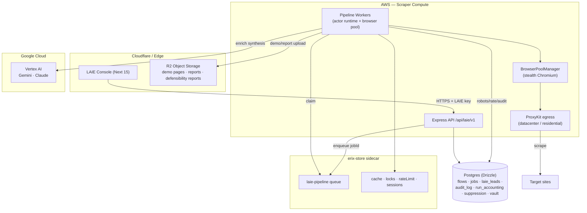
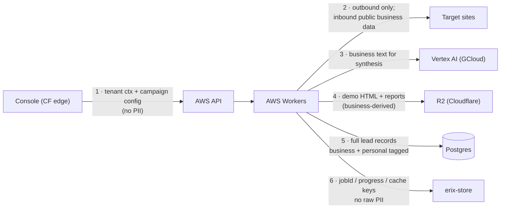
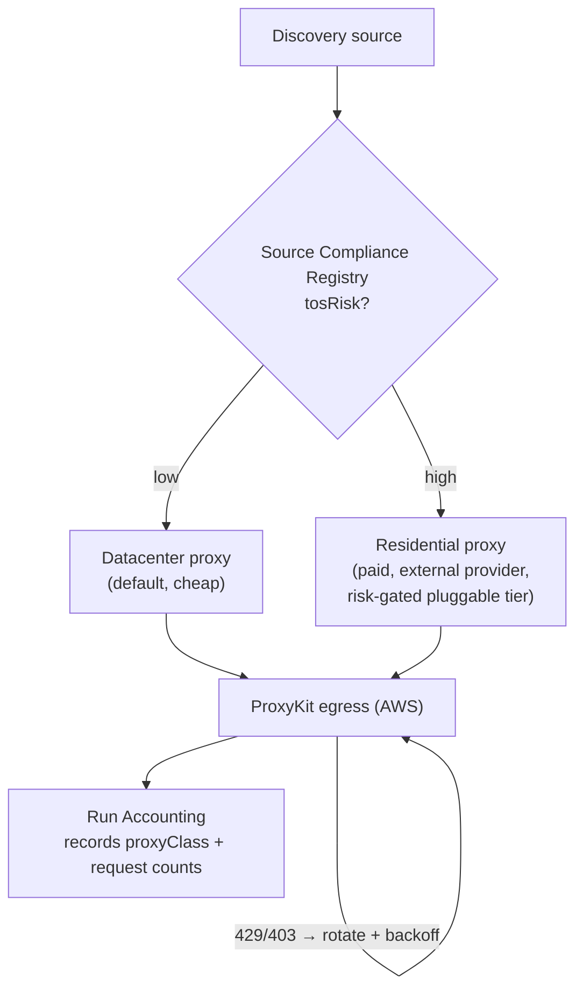

# LAIE — Multi-Cloud Architecture

> **Version:** 1.0
> **Date:** 2026-06-08
> **Status:** Authoritative for the LAIE Engine MVP multi-cloud topology.
> **Source of truth:** `ECOD/saas/.kiro/specs/laie-engine-mvp/design.md`
> (Architecture section) and `requirements.md` Requirement 1 (1.1–1.5) and
> Requirement 3 (3.5). This doc formalizes the design's Architecture section
> into the standalone, versioned artifact required by Req 1.5.
> **Read alongside:** `laie-design-consolidated.md` (product boundary),
> `laie-pipeline-operations.md` (run lifecycle), `PLATFORM_DATA_BOUNDARIES.md`
> (Postgres vs Mongo data rule).

---

## 0. Purpose

This is the `LAIE_Architecture_Document` referenced by Requirement 1. It records,
for the LAIE engine:

1. The component → cloud map — which runtime component runs on Google Cloud,
   Cloudflare, or AWS, with rationale (Req 1.1, 1.2).
2. The erix-store dependency and where it sits (Req 1.3, 1.5).
3. Cross-cloud data flows and the data categories that cross each boundary
   (Req 1.4).
4. The proxy cost-awareness policy governing residential-vs-datacenter
   selection (Req 3.5).

Everything below is grounded in `design.md`. Where the design leaves a
placement ambiguous it is marked **TBD / see design** rather than guessed.
Each component carries the design's **EXISTS / EXTEND / NEW** status so
traceability is preserved.

---

## 1. Component → cloud map (Req 1.1, 1.2)

Derived verbatim from the design's "Multi-cloud component map" table.

| Component                                                       | Cloud                             | Status          | Rationale                                                                                                                                             |
| --------------------------------------------------------------- | --------------------------------- | --------------- | ----------------------------------------------------------------------------------------------------------------------------------------------------- |
| Vertex AI — Gemini (research/synthesis), Claude (outreach kits) | **Google Cloud**                  | EXISTS          | Managed AI; ADC auth; `geminiClient.ts` / `claudeClient.ts`.                                                                                          |
| Object storage — demo pages, reports, defensibility reports     | **Cloudflare R2**                 | EXISTS / EXTEND | S3-compatible, zero egress fees; `cloudflareR2.ts`.                                                                                                   |
| Scraper compute (browser pool, actor runtime, pipeline workers) | **AWS**                           | EXISTS          | Chromium needs real CPU/RAM; predictable egress for proxy traffic.                                                                                    |
| Proxy egress (datacenter + residential)                         | **AWS + external proxy provider** | EXTEND          | Residential pool is the scale gap vs Apify; see §4 cost policy.                                                                                       |
| Queue / cache / locks / rate-limit / sessions                   | **erix-store** (`@lib/erix`)      | EXISTS          | Shared platform sidecar; `laie-pipeline` queue, `queueV2`, `cache`, `locks`, `rateLimit`. See §3.                                                     |
| Postgres (Drizzle) — flows, jobs, leads, audit, accounting      | **Managed Postgres (Supabase)**   | EXISTS / EXTEND | System of record; new tables (`laie_scrape_audit`, `laie_run_accounting`, `laie_suppression`, `laie_business_vault`, usage ledgers) added by the MVP. |
| Console (Next 15)                                               | **Vercel / edge**                 | EXISTS          | Talks to backend via `/api/laie/v1` proxy.                                                                                                            |

Mapped to the Req 1.2 runtime-component list:

| Req 1.1 runtime component | Hosting cloud                                 |
| ------------------------- | --------------------------------------------- |
| Actor runtime             | AWS                                           |
| Browser pool              | AWS                                           |
| Proxy network             | AWS egress + external proxy provider (see §4) |
| Job queue                 | erix-store sidecar (§3)                       |
| Cache                     | erix-store sidecar (§3)                       |
| Object storage            | Cloudflare R2                                 |
| AI services               | Google Cloud (Vertex AI — Gemini, Claude)     |

> Req 1.2 statement, satisfied: Vertex AI (Gemini, Claude) runs on **Google
> Cloud**; object storage for demo pages and reports uses **Cloudflare R2**;
> scraper compute and proxy egress run on **AWS**.

### Topology diagram

---

## 2. Cross-cloud data flows + data categories (Req 1.4)

Each cross-cloud boundary and the data category that crosses it, taken from the
design's "Cross-cloud data flows and categories" table. Data categories use the
`business/factual` vs `personal` distinction defined in Requirement 20 and
enforced by `dataClassifier.ts`.

| #   | Flow                          | Direction      | Data category crossing the boundary                                                |
| --- | ----------------------------- | -------------- | ---------------------------------------------------------------------------------- |
| 1   | Console → AWS API             | Edge → AWS     | Tenant context, campaign config — **no PII payloads**                              |
| 2   | AWS Workers → Target sites    | AWS → Internet | Outbound requests only; inbound = public **business/factual** data                 |
| 3   | AWS Workers → Vertex (GCloud) | AWS → GCloud   | **Business text** (website content, business name) for synthesis                   |
| 4   | AWS Workers → R2 (Cloudflare) | AWS → CF       | Generated demo HTML + report artifacts (**business-derived**)                      |
| 5   | AWS ↔ Postgres                | AWS ↔ Supabase | Full lead records, with fields tagged **business** vs **personal**                 |
| 6   | AWS ↔ erix-store              | AWS ↔ sidecar  | Job ids, progress, cache keys — **no raw PII in queue payload** (only `{ jobId }`) |

Notes grounded in the design:

- The queue payload deliberately carries **only `{ jobId }`** — raw PII never
  transits erix-store (design §Architecture flow 6; mirrored in the Error
  Handling and Two-phase pipeline sequence diagram).
- Personal data, where collected, is confined to flows 5 (Postgres system of
  record). The Global Business Vault (`laie_business_vault`) stores
  **business/factual fields only** — personal data and enrichment outputs are
  dropped before write (design Area G; Req 35.2 / 38.1 / 40.1), so it does not
  add a new personal-data cross-cloud path.

---

## 3. erix-store dependency (Req 1.3, 1.5)

LAIE depends on **erix-store** (`@lib/erix`) — the shared platform sidecar — for
its queue/runtime layer. Per the platform README, erix-store runs on **port
6399** and replaces Redis + BullMQ for the platform.

| erix-store capability | LAIE use                                                                               | Status          |
| --------------------- | -------------------------------------------------------------------------------------- | --------------- |
| `laie-pipeline` queue | Job queue for opt-in queue mode (`LAIE_QUEUE_PIPELINE=true`); carries `{ jobId }`      | EXISTS          |
| `queueV2`             | Queue runtime backing the pipeline worker                                              | EXISTS          |
| `cache`               | Per-run progress, intermediate cache keys                                              | EXISTS          |
| `locks`               | Cross-worker coordination                                                              | EXISTS          |
| `rateLimit`           | Multi-worker per-host scrape rate limiting (`rateLimit.check(scrape:${host})`, Req 18) | EXISTS / EXTEND |
| sessions              | Session/cookie reuse for the SessionManager                                            | EXISTS          |

Hosting location: erix-store is a **shared platform sidecar** co-located with the
AWS scraper compute as a sidecar service (it is the queue/cache/locks/rate-limit
runtime LAIE workers claim from and write to). It is **not** a managed Google
Cloud or Cloudflare service; it is the platform's own runtime
(`ErixStore` on port 6399). The `laie-pipeline` workers are registered in
`lib/laie/index.ts` with `maxConcurrentJobs = LAIE_PIPELINE_CONCURRENCY ?? 2`
and `pollIntervalMs = LAIE_PIPELINE_POLL_MS ?? 5000`.

> **Restart-safety dependency (design Error Handling, Req 4):** if a worker
> dies mid-run, erix-store re-queues the job (≥3 attempts); the dedup hash
> prevents duplicate `laie_leads`. If enqueue fails, the dispatcher falls back
> to inline `processJob` so the run is not lost.

---

## 4. Proxy cost-awareness policy (Req 3.5)

The proxy layer balances **success rate against cost** by selecting a proxy
class per source from a risk classification, not from hardcoded hostnames. This
is the cost-awareness policy Req 3.5 requires the architecture document to
record.

### Policy

| Source ToS / anti-bot risk | Proxy class assigned | Cost profile                | Basis                                |
| -------------------------- | -------------------- | --------------------------- | ------------------------------------ |
| **Low**                    | **Datacenter**       | Cheap, fast, more blockable | Req 3.2 — default tier               |
| **High**                   | **Residential**      | Expensive, paid per-GB      | Req 3.1 — risk-gated, pluggable tier |

- **Datacenter is the default.** Most sources run on datacenter IPs because they
  are cheaper and faster (design: "low → datacenter").
- **Residential is a risk-gated, pluggable tier.** It is assigned only to
  sources classified **high anti-bot risk** in the Source Compliance Registry
  (`lib/laie/sourceCompliance.ts`), which feeds `proxyPolicy.proxyClassForSource()`
  (design §"ProxyKit tier-selection policy", Req 3.1/3.2/19). Selection is driven
  by the `proxyClass` field on each `SourceCompliance` entry, not by hostname.
- **Residential cannot be self-built for free.** A residential pool is sourced
  from consumer-ISP addresses and is supplied by an **external proxy provider**
  (the component map lists proxy egress as "AWS + external proxy provider", and
  the design notes "Residential pool is the scale gap vs Apify"). It is a paid,
  metered dependency — it is not something LAIE can stand up itself at zero cost.
  The policy therefore treats residential as a **pluggable** tier reserved for
  high-ToS-risk sources where datacenter success rates are inadequate, so spend
  is incurred only where it is justified.
- **Rotation & backoff are cost controls too.** On reaching the configured
  rotation threshold the ProxyKit rotates IP; on HTTP 429/403 it rotates and the
  runtime applies exponential backoff (Req 3.3/3.4) — limiting wasted paid
  requests against defended hosts.

### Cost accounting linkage

Run cost is recorded by the Run Accounting Service (`laie_run_accounting`),
which captures `proxyClass`, `outboundRequests`, and `browserSessions` per run
(Req 5). This makes the cost of the residential tier observable per run and per
tenant, closing the loop on the cost-awareness policy.

> **Verify in staging.** Per the design's honesty note, live scraping against
> real sites and **residential-proxy behavior** cannot be fully verified in the
> dev environment. The policy above is verified by type/contract here; actual
> residential success rates, rotation behavior under load, and per-GB cost must
> be validated in staging per the `laie-pipeline-operations.md` rollout steps.

---

## 5. Traceability to requirements

| Requirement | Where satisfied in this doc                         |
| ----------- | --------------------------------------------------- |
| 1.1         | §1 component → cloud map (+ rationale)              |
| 1.2         | §1 (Vertex/GCloud, R2/CF, AWS statement)            |
| 1.3         | §3 erix-store dependency + hosting                  |
| 1.4         | §2 cross-cloud data flows + categories              |
| 1.5         | This versioned artifact under `ECOD/.Architecture/` |
| 3.5         | §4 proxy cost-awareness policy                      |

---

## 6. Open / TBD items (honest gaps)

- **External residential proxy provider** is referenced by the design as
  "external proxy provider" but a specific vendor is **TBD / see design** — the
  design does not name one. This doc records the policy, not a vendor choice.
- **erix-store precise hosting node** (which AWS host/region the sidecar runs
  on) is operational detail not fixed by the design; recorded here as a
  co-located platform sidecar (port 6399) — confirm exact placement in the
  ops runbook.
- Residential-tier success/cost characteristics are **verify-in-staging** (see
  §4 note).
